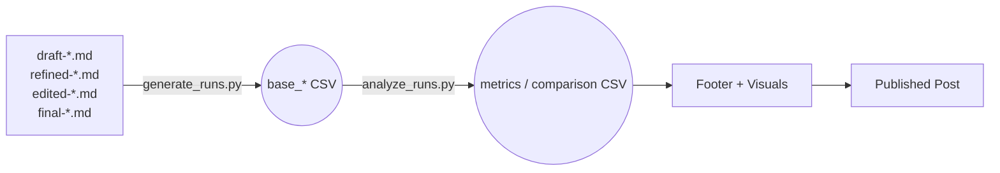

Here's the complete updated README for the scripts directory:

```markdown
# AI Authorship Analysis Scripts

This directory contains Python scripts for analyzing and comparing the transformation of articles through different stages of authorship—from AI-generated drafts to fully human-authored final versions. By facilitating detailed documentation of content evolution, these tools are designed to support ethical transparency, inform responsible AI practices in creative workflows, and build trust with readers.

## Purpose

These scripts help quantify how content changes across distinct editorial stages:

* To distinguish between AI and human contributions
* To support clear, consistent disclosure practices
* To provide a reproducible, metrics-based view of editorial progression

### Workflow



Typical flow (works in ChatGPT with Code Interpreter, Claude Tools, etc.):

Upload
- generate_runs.py
- The four article markdown files

Tell the chat:
`Run generate_runs.py on these four markdown files (draft, refined, edited, final). Use the default output name base. Show me the generated CSV files.`

The AI environment installs pandas/numpy for you, executes the script, and returns the CSVs to download.

Upload those new CSVs plus analyze_runs.py and instruct the AI:
`Run analyze_runs.py on base_agg.csv and show the metrics.`

## Scripts in This Directory

### `generate_runs.py`

**Function:**
Runs three randomized comparisons of content retention across four editorial stages: `Draft → Refined → Edited → Final`.

For each run, sentence and paragraph thresholds are randomly selected from controlled ranges to vary structural alignment sensitivity.

**Outputs:**

| File              | Description                                                                                                                                                                                                                     |
| ----------------- | ------------------------------------------------------------------------------------------------------------------------------------------------------------------------------------------------------------------------------- |
| `*_run_level.csv` | Per-run retention metrics for each version transition. Includes:• `RunID`, `Previous Version`, `Current Version`• Thresholds: `SentenceThreshold`, `ParagraphThreshold`• Retention: `Char`, `Word`, `Sentence`, `Paragraph` (%) |
| `*_agg.csv`       | Aggregated averages across all runs for each version-pair. Reflects the same retention metrics as above.                                                                                                                        |

**Limitations:**

* No semantic or qualitative analysis
* Does not identify factual inaccuracies or assess writing quality
* Does not calculate alteration percentages (use: 100% - retention%)

### `analyze_runs.py`

**Function:**
Compares two sets of aggregated metrics (typically from different AI models) across identical editorial stage transitions. Produces numeric deltas and side-by-side summaries to highlight divergence between runs.

**Outputs:**

| File              | Description                                                                                               |
| ----------------- | --------------------------------------------------------------------------------------------------------- |
| `*_delta.csv`     | Delta between base and high runs. Shows percentage point differences in retention across all transitions. |
| `*_agg.csv`       | Combined aggregate report. Lists base and high run values for all metrics side-by-side.                   |
| `*_aggregated.md` | Markdown-formatted table summarizing comparison outcomes for reference or publication.                    |

**Limitations:**

* Focused strictly on numeric differences
* Assumes consistent structure in inputs
* No interpretation of content quality or editorial intent

### `build_footer_and_charts.py`

**Function:**
Creates article footers with basic visualizations from metrics CSV data.

**Current Visualizations:**
- Word vs sentence retention (grouped bar chart)
- Character vs paragraph retention (grouped bar chart)
- Retention breakdown (stacked bar chart)

**Note:** Current charts are basic matplotlib visualizations. More sophisticated transformation flow diagrams and human/AI contribution charts are planned.

### `article_content.py`

**Function:**
Generates comprehensive analysis reports with visualizations. Can output markdown reports and charts as either files or base64-encoded strings for AI tool consumption.

**Features:**
- Content attribution summaries
- Automatic disclosure recommendations based on alteration percentages
- Pie charts for alteration by stage
- Horizontal bar charts for retention metrics

## Data Interpretation

### Understanding Retention vs Alteration

- **Retention %**: How much content from a previous version appears in the current version
- **Alteration %**: How much new content was added (100% - retention%)
- High retention = Low human contribution
- Low retention = High human contribution

### Stage Progression

1. **Draft → Refined**: Typically high retention (AI refining AI)
2. **Refined → Edited**: Variable retention (human intervention begins)
3. **Edited → Final**: Usually high retention (final polish)
4. **Draft → Final**: Overall AI contribution metric

## When to Use These Scripts

Use this directory when:

* You want to systematically compare different AI models' behavior across content stages
* You need quantitative support for AI use disclosures
* You're preparing a methodology page or compliance summary documenting content integrity

## Quick Start Guide

### For AI Chat Environments (ChatGPT, Claude)

1. Upload these files:
   - `generate_runs.py`
   - Your four article versions: `draft-*.md`, `refined-*.md`, `edited-*.md`, `final-*.md`

2. Run analysis:
   ```
   Run generate_runs.py with these markdown files to generate base CSVs
   ```

3. Generate comparisons:
   ```
   Run analyze_runs.py on the base_agg.csv to see retention metrics
   ```

### Expected Outputs

- **Retention Metrics**: Character, word, sentence, and paragraph retention percentages
- **Stage Analysis**: How content transforms through each editorial stage
- **Visual Charts**: Basic matplotlib visualizations (improvements planned)

## Limitations

These scripts measure structural similarity, not:
- Content quality or coherence
- Factual accuracy
- Tone or style consistency
- Semantic meaning preservation

## Disclosure and Ethics

These tools are designed to support **transparent AI usage**, not to automate editorial judgment. Transparency is a cornerstone of ethical content creation and crucial for **building and maintaining reader trust**. The outputs from these scripts inform, but do not replace, **human oversight, editing, and final judgment**. All final content analysis and publishing decisions should be made by human authors with clear disclosure of AI involvement. **Human contribution is also what grants copyright to the final work**.

For recommended phrasing and integration into article-level and site-wide disclosures, refer to the [AI Use & Editorial Workflow Policy](../../ai-use.md).

## License

These scripts are provided under the MIT License. See [LICENSE](../LICENSE) for details.