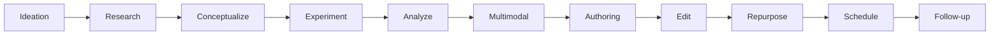

# Pipeline Guide & Reference

**Updated:** May 18, 2025
**Applies to:** Sublime Text + Merge workflow, Claude 3.7 Sonnet, GPT-4-o, OpenAI o3, Gemini 2.x

---

## Table of Contents

1. [Overview](#overview)
2. [Roles](#roles)
3. [Model Mapping & Token Budgets](#model-mapping--token-budgets)
4. [End-to-End Workflow (GUI-Only)](#end-to-end-workflow-gui-only)
5. [Bias / Contamination Controls](#bias--contamination-controls)
6. [Change Log](#change-log)

---

## Overview

The pipeline minions are an experiment in agent-like workflows using the web UI of AI models.

You copy-paste pre-built ROCC prompt sheets into the relevant model, save the files it returns, commit in Sublime Merge, and move on.

---

## Roles

| Stage              | Role Name                   | Primary Model                   | Key Outputs                                                |
| ------------------ | --------------------------- | ------------------------------- | ---------------------------------------------------------- |
| Ideation / Concept | **Brainstormer**            | Claude 3.7 Sonnet               | `concept_notes.json`, `.md`                                |
| Experiment         | **Experiment-Designer**     | o3 (high) / Gemini 2.5 Pro      | `design.json`, `rubric.json`, `experiment_instructions.md` |
| Analyze            | **Independent-Analyst**     | o3 (med/high) / Gemini 2.5 Pro  | `scores.json`, `analysis_summary.md`                       |
| Multimodal         | **Interviewer-Synthesizer** | GPT-4-o / Gemini 2.x            | `interview_transcript.md`, `multimodal.toml`               |
| Authoring          | **Author**                  | Claude 3.7 Sonnet               | `draft.md` → user feedback → `refined.md`, `author.toml`   |
| Edit               | **Editor-Arbiter**          | Gemini 2.5 Pro                  | `edited.md`, `change_log.md`                               |
| Repurpose          | **Content-Splitter**        | GPT-4-o / Claude / Gemini Flash | `medium_blurbs.md`, `social_snippets.json`                 |
| Schedule           | **Scheduler**               | any fast model                  | `schedule.toml`                                            |
| Follow-up          | **Responder**               | any fast model                  | `followup.toml`                                            |

* **One manifest per stage**
* All files under 20 MB (UI upload safe)
* `cited_sources` array required even if empty
---

## Model Mapping & Token Budgets

| Role                | Token Ceiling | Notes                          |
| ------------------- | ------------- | ------------------------------ |
| Brainstormer        | **6 k**       | SCAMPER + wildcard angle       |
| Experiment-Designer | **8 k**       | protocol & rubric only         |
| Independent-Analyst | **16 k**      | may refine rubric once         |
| Multimodal          | **32 k**      | reads analysis, cannot alter   |
| Author              | **64 k**      | pause after draft for feedback |
| Editor              | **64 k**      | full fact-cross-check          |
| Down-stream minors  | 8 k – 32 k    | see individual prompts         |

---

## End-to-End Workflow (GUI-Only)

1. **Clone template** → edit manifests in Sublime Text → commit.
2. **Brainstormer** (Claude) → save outputs → commit.
3. **Experiment-Designer** → save protocol & rubric → commit.
4. Run experiment manually; drop `raw_data.csv` → commit.
5. **Independent-Analyst** → save scores & summary → commit.
6. **Multimodal** → Q\&A cycle → save transcript + TOML → commit.
7. **Author** → draft → feedback → continue → refined → commit.
8. **Editor** → edited file + change log → commit.
9. **Content-Splitter** → repurpose snippets → commit.
10. **Scheduler** → schedule TOML → commit.
11. **Responder** → follow-up TOML → commit & push.

All exchanges happen in web-chat tabs; files are copied into the repo tree.

---

## Bias / Contamination Controls

* Separate chat sessions per role
* Capital-letter constraints (“DO NOT MODIFY ANALYSIS”)
* Manifest-only context ingestion
* Human review after Editor stage
* Optional Perplexity + NotebookLM fact-check loop

---

## Change Log

* **May 18, 2025** – consolidated token budgets, added Scheduler & Responder prompts, wrapped all stage folders under `stages/`, swapped `.txt` placeholders to `.md`, updated platform helper table.
* Earlier history preserved in Git commit log.